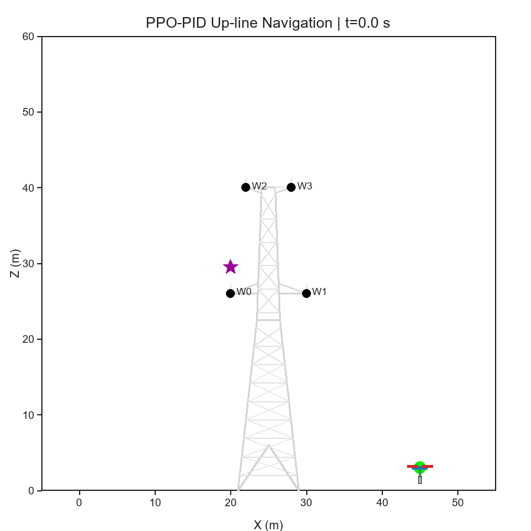
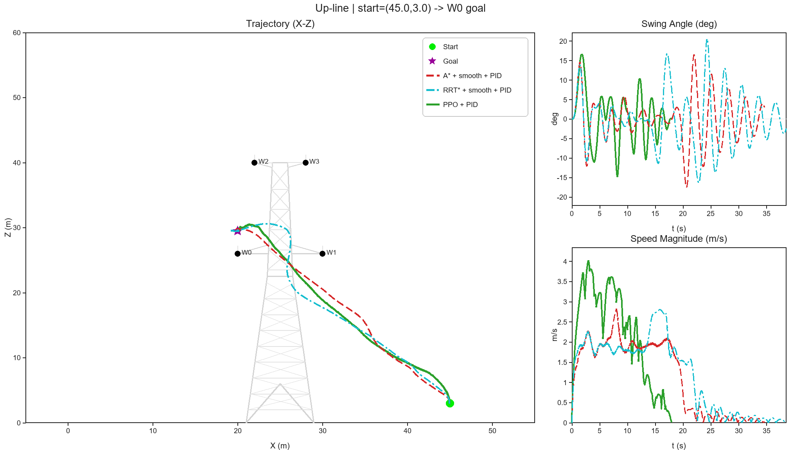
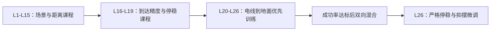

# PPO-PCUAV

面向架空输电线场景的吊运无人机分层 **PPO-PID** 导航项目。仓库包含 26 级课程训练、断点续训、L26 微调、预训练权重推理和可视化 Demo。高层 PPO 根据无人机、负载、目标与电线的相对状态生成离散局部航点，底层级联 PID 在二维非线性动力学模型中完成轨迹跟踪与主动抑摆。





## 项目特点

- 预训练 PPO 权重随仓库提供，无需重新训练即可运行。
- 包含论文实验使用的 26 级课程环境、奖励函数和 PPO 训练入口。
- 统一动力学与 PID 控制器，对比 PPO、A* 和 RRT* 三种规划策略。
- 可视化沿用原论文代码中的输电塔桁架、无人机吊载造型和三联图布局。
- 一条命令同时生成动态 GIF、轨迹对比图和指标 JSON。
- 默认使用 CPU，Windows 下无需 FFmpeg 或图形界面。
- 仅保留训练、推理与演示所需源码，不包含历史训练日志和中间检查点。

## 方法概览


- 状态：无人机 8 维运动状态、2 维相对目标位置、4 根电线的 8 维相对位置。
- 动作：9 个航点距离档位与 24 个方向档位组成的 `MultiDiscrete([9, 24])`。
- 控制：位置环、速度环、姿态环和角速度环组成的级联 PID。
- 动力学：考虑机体阻尼、负载转动惯量和吊挂摆动阻尼的二维耦合模型，采用 RK4 积分。

## 快速运行

推荐使用 Conda 和 Python 3.10：

```powershell
conda env create -f environment.yml
conda activate ppo-pcuav
pip install -e .
python demo.py
```

运行完成后生成：

```text
outputs/
├── ppo_navigation.gif
├── trajectory_comparison.png
└── metrics.json
```

切换任务方向或目标电线：

```powershell
python demo.py --mode wire_to_ground --wire 2
```

完整参数：

```powershell
python demo.py --help
```

## PPO 训练

训练流程来自原论文代码，并整理为独立于 Demo 的训练环境。训练与推理使用相同的动力学、PID、18 维观测和 `MultiDiscrete([9, 24])` 动作空间。



课程升级采用最近 200 个 episode 的成功率：L1-L15 为 `0.80`，L16-L19 为 `0.95`，L20-L24 为 `0.75`，L25 为 `0.85`，L26 为 `0.95`。L20 以后先训练 `wire_to_ground`，成功率达到 `0.80` 后切换为上下线各半的混合采样。

### 验证训练链路

以下命令只运行 128 个时间步，用于检查环境、PPO 更新和模型保存，不会得到可用策略：

```powershell
python train.py --smoke-test --output-dir training_runs/smoke
```

### 从零开始完整课程训练

```powershell
python train.py `
  --output-dir training_runs/full `
  --start-level 1 `
  --n-envs 6 `
  --total-timesteps 20000000 `
  --tensorboard
```

训练计算量较大，`20,000,000` 是单次训练预算，不代表一定能够完成全部课程；实际升级由成功率决定。

### 断点续训

```powershell
python train.py --output-dir training_runs/full --resume auto --tensorboard
```

`--resume auto` 会选择该目录中最新的中断模型、最终模型或定期检查点，并从 `training_state.json` 恢复当前课程等级。将外部权重放入新目录续训时，应显式提供 `--start-level`。

### 使用随仓库提供的权重继续进行 L26 微调

```powershell
python train.py `
  --output-dir training_runs/l26_finetune `
  --resume pretrained `
  --finetune-level-26 `
  --tensorboard
```

L26 微调默认训练 `8,000,000` 个时间步、熵系数为 `0.04`，并以 `0.85` 的概率采样 `wire_to_ground`；这些参数均可通过命令行覆盖。

训练目录结构：

```text
training_runs/full/
├── checkpoints/                 # 定期断点
├── completed_levels/            # 每级通过时保存的模型
├── best_model.zip               # 评估平均奖励最佳模型
├── final_model.zip              # 正常训练结束时的模型
├── interrupted_model.zip        # Ctrl+C 中断时保存
├── evaluations.npz              # 定期评估结果
├── training_state.json          # 当前课程等级
└── tensorboard/                 # 使用 --tensorboard 时生成
```

查看训练曲线：

```powershell
tensorboard --logdir training_runs/full/tensorboard
```

## 默认 Demo 结果

默认场景为地面点 `(45, 3)` 到 W0 上方作业点。三种方法采用相同的动力学、控制器和到达判据：位置误差小于 `0.10 m`、速度小于 `0.05 m/s`，并连续保持 `0.5 s`。

| 方法 | 成功 | 运动时间 / s | 轨迹长度 / m | 最大摆角 / ° | 摆动强度 / rad²·s |
| --- | ---: | ---: | ---: | ---: | ---: |
| PPO-PID | 是 | 18.00 | 38.964 | 16.594 | 0.2444 |
| A*-PID | 是 | 34.64 | 39.748 | 17.516 | 0.3614 |
| RRT*-PID | 是 | 38.54 | 44.823 | 20.544 | 0.5607 |

这些数值来自固定场景的单次可复现 Demo，用于验证代码与权重可运行；它们不替代论文中的多场景、多次重复统计结果。

此外，预训练策略已在 4 根线路的上线、下线共 8 个固定场景中逐一验证，8 个场景均成功到达。

## 项目结构

```text
PPO_PCUAV/
├── demo.py                         # 一键演示入口
├── train.py                        # PPO 课程训练入口
├── media/                           # README 中展示的已验证结果
├── src/ppo_pcuav/
│   ├── assets/ppo_policy.zip        # wheel 内置的预训练 PPO 权重
│   ├── assets.py                    # 统一解析内置权重路径
│   ├── config.py                    # 物理参数
│   ├── dynamics.py                  # 二维吊运系统动力学
│   ├── controller.py                # 级联 PID
│   ├── environment.py               # Gymnasium 推理环境
│   ├── training_environment.py      # 26 级课程环境与训练奖励
│   ├── training.py                  # PPO、课程回调、评估与断点续训
│   ├── planning.py                  # A*、RRT* 与安全平滑
│   ├── simulation.py                # 统一仿真与指标计算
│   ├── visualization.py             # 纯 Pillow 图像与 GIF 输出
│   └── demo.py                      # Demo 编排
├── tests/test_smoke.py              # 环境及权重契约测试
├── environment.yml
├── requirements.txt
└── pyproject.toml
```

## 测试

```powershell
pytest -q
```

测试会检查推理和训练环境的 Gymnasium 接口、18 维观测、动作空间、课程任务采样、物理轨迹记录，以及预训练权重与当前环境的输入输出契约。

## 模型信息

- 训练框架：Stable-Baselines3 2.7.1
- 训练环境：Python 3.10.19、PyTorch 2.9.1、Gymnasium 1.2.3
- 推理设备：CPU
- 文件大小：2,578,176 字节
- SHA-256：`6FC8605D83C62D7ED24B86902C6451FC41C37FA9E74128BD2B8E8A9B8EBADA43`

## 工程结构参考

项目结构参考了以下公开仓库的可复现组织方式，但核心动力学、环境、控制器与演示代码均由本项目整理实现：

- [gym-pybullet-drones](https://github.com/utiasDSL/gym-pybullet-drones)：可安装核心包、示例与测试分离。
- [NavRL](https://github.com/Zhefan-Xu/NavRL)：预训练模型与快速 Demo 优先展示。
- [PPO-based Autonomous Navigation for Quadcopters](https://github.com/bilalkabas/PPO-based-Autonomous-Navigation-for-Quadcopters)：训练入口与权重推理入口分离。
- [Drone 2D Custom Gym Environment](https://github.com/marek-robak/Drone-2d-custom-gym-env-for-reinforcement-learning)：自定义环境接口及状态、动作说明。
- [PythonRobotics](https://github.com/AtsushiSakai/PythonRobotics)：最小依赖的 A*、RRT* 路径规划示例组织。

## 说明

本仓库定位为论文方法的可训练、可推理、可复现演示，不包含历史训练日志与中间权重。

## 许可证

本项目采用 [MIT License](LICENSE)。
